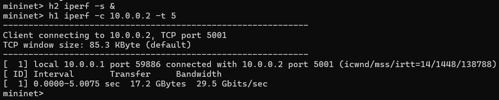

# SDN-Based Access Control System

Course: Computer Networks 

Project Type: SDN Mininet Simulation

---

## Project Overview

This project implements a security-focused SDN (Software-Defined Networking) controller using the POX framework. The primary goal is to enforce a network access policy where only "authorized" devices can communicate, while all "unauthorized" traffic is blocked and logged.

---

## Problem Statement

Implement an SDN controller that:

* Maintains a Whitelist of authorized MAC addresses (h1 and h2).
* Intercepts all incoming packets via the PacketIn handler.
* Automatically drops packets originating from unauthorized MAC addresses (h3 and h4).
* Installs specific Match-Action flow rules on the Open vSwitch for authorized traffic to minimize controller overhead.

---

## Working of the SDN Access Control

The SDN controller operates using a whitelist-based access control combined with learning switch behavior:

* When a packet arrives, the switch sends a **PacketIn** to the controller if no rule exists.
* The controller checks the **source MAC address**:

  * If it is in the whitelist (h1, h2) → packet is allowed
  * Otherwise (h3, h4) → packet is dropped
* The controller learns **MAC-to-port mapping** to track host locations.
* If the destination MAC is known:

  * A **flow rule (match–action)** is installed and packet is forwarded
* If the destination is unknown:

  * The packet is **flooded** to discover the host
* Once rules are installed, future packets are handled directly by the switch

 This demonstrates centralized control, dynamic rule installation, and efficient packet forwarding in SDN.

---

## Setup and Execution

### 1. Prerequisites

Ensure you have Mininet and POX installed in your Ubuntu/WSL environment.

---

### 2. Running the Controller

Place access_control.py in the pox/ext directory and run:

```bash id="a1"
python3 pox.py log.level --DEBUG ext.access_control
```

---

### 3. Launching the Network

In a separate terminal, start the Mininet topology:

```bash id="a2"
sudo mn --topo single,4 --controller remote,ip=127.0.0.1,port=6633 --mac
```


---

## Results & Validation

### Connectivity Testing

* **h1 -> h2 (Authorized):** Communication is successful with 0% packet loss.

```bash id="a3"
mininet> h1 ping h2
```


---

* **h3 -> h4 (Unauthorized):** Communication is blocked; results in 100% packet loss.

```bash id="a4"
mininet> h3 ping h4
```


---

* **pingall:** Demonstrates that authorized hosts are reachable while unauthorized hosts are restricted based on the whitelist policy.

```bash id="a5"
mininet> pingall
```


---

## Performance Testing using iPerf

To evaluate network performance and validate access control, **iperf** is used to measure throughput between hosts.

### 🔹 Test Setup

Start iperf server on h2:

```bash id="a6"
mininet> h2 iperf -s &
```

Run iperf client on h1:

```bash id="a7"
mininet> h1 iperf -c 10.0.0.2 -t 5
```

---

### 🔹 Observed Output



---

### 🔹 Result Analysis

* Successful TCP connection between h1 and h2
* Data transfer ~17–18 GBytes in 5 seconds
* Throughput ~29–31 Gbits/sec
* High bandwidth due to Mininet virtual environment

 Confirms that authorized hosts communicate efficiently.

---

### 🔹 Unauthorized Case (Expected Behavior)

```bash id="a8"
mininet> h3 iperf -c 10.0.0.4
```

* Connection fails or no throughput observed

 Confirms access control enforcement.

---

## Flow Table Verification

By running the following command on the switch:

```bash id="a9"
dpctl dump-flows
```

We observe that the controller installs flow entries that:

* Match whitelisted MAC addresses (h1, h2) → Forward action
* Match non-whitelisted MAC addresses (h3, h4) → Drop action


---

## Technical Implementation Details

* **POX Controller:** Uses the pox.openflow.libopenflow_01 library.
* **Whitelist Enforcement:** Only specified MAC addresses are permitted.
* **Reactive Flow Installation:** Flow rules are installed dynamically upon PacketIn events.
* **ARP Handling:** ARP packets are allowed to ensure proper host discovery.
* **Flow Rules:**

  * Authorized → Forward
  * Unauthorized → Drop
* **Controller Logging:** Logs allow/deny decisions for verification.

---

## Conclusion

The SDN controller successfully enforces a whitelist-based access control mechanism. Authorized hosts are allowed to communicate, while unauthorized hosts are blocked using dynamically installed OpenFlow rules. iPerf testing further confirms high performance and correct policy enforcement.

---

## References

* Mininet Documentation
* POX Controller Documentation
* OpenFlow Specification
