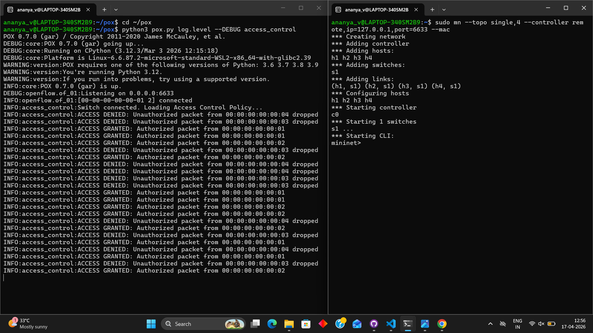
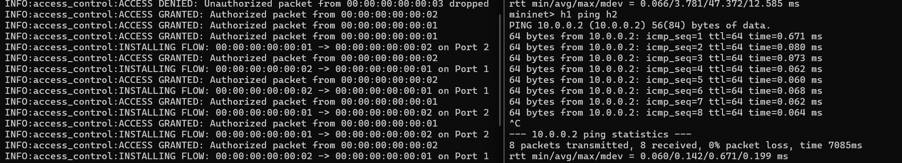
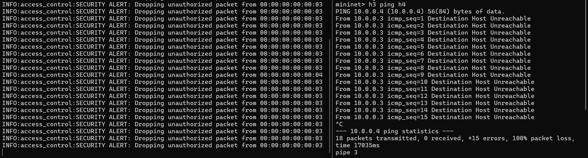
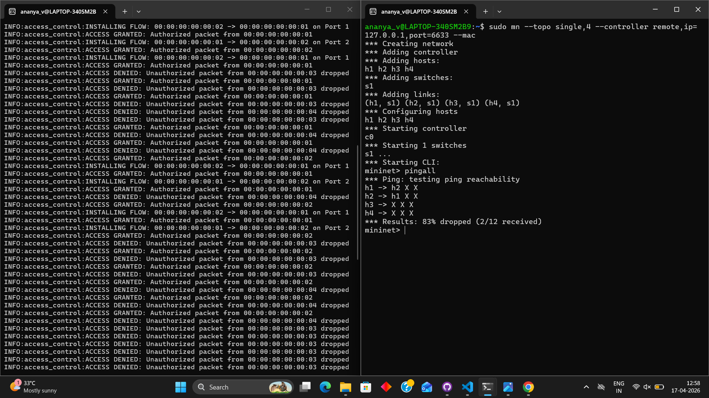
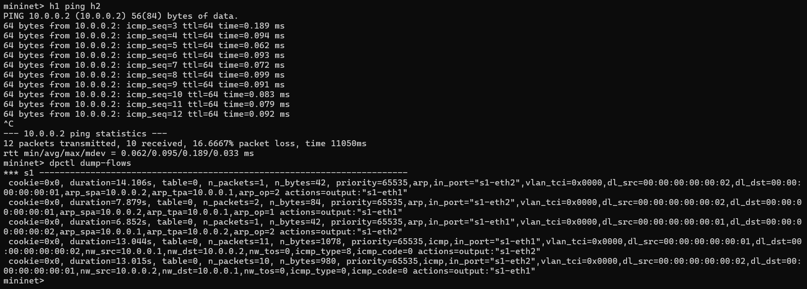

# SDN-Based Access Control Whitelist

Course: Computer Networks Lab

Project Type: SDN Mininet Simulation

---

## Project Overview

This project implements a security-focused SDN (Software-Defined Networking) controller using the POX framework. The primary goal is to enforce a network access policy where only "authorized" devices can communicate, while all "unauthorized" traffic is blocked and logged.

---

## Problem Statement

Implement an SDN controller that:

* Maintains a Whitelist of authorized MAC addresses (h1 and h2).
* Intercepts all incoming packets via the PacketIn handler.
* Automatically drops packets originating from unauthorized MAC addresses (h3 and h4).
* Installs specific Match-Action flow rules on the Open vSwitch for authorized traffic to minimize controller overhead.

---

## Setup and Execution

### 1. Prerequisites

Ensure you have Mininet and POX installed in your Ubuntu/WSL environment.

---

### 2. Running the Controller

Place access_control.py in the pox/ext directory and run:

```bash
python3 pox.py log.level --DEBUG access_control
```

---

### 3. Launching the Network

In a separate terminal, start the Mininet topology:

```bash
sudo mn --topo single,4 --controller remote,ip=127.0.0.1,port=6633 --mac
```



---
w
## Results & Validation

### Connectivity Testing

* **h1 -> h2 (Authorized):** Communication is successful with 0% packet loss.

```bash
mininet> h1 ping -c 3 h2
```



---

* **h3 -> h4 (Unauthorized):** Communication is blocked; results in 100% packet loss.

```bash
mininet> h3 ping -c 3 h4
```



---

* **pingall:** Demonstrates that authorized hosts are reachable while unauthorized hosts are restricted based on the whitelist policy.

```bash
mininet> pingall
```



---

## Flow Table Verification

By running the following command on the switch:

```bash
dpctl dump-flows
```

We observe that the controller installs flow entries that:

* Match whitelisted MAC addresses (h1, h2) → Forward action
* Match non-whitelisted MAC addresses (h3, h4) → Drop action



---

## Technical Implementation Details

* **POX Controller:** Uses the pox.openflow.libopenflow_01 library.
* **Whitelist Enforcement:** Only specified MAC addresses are permitted.
* **Reactive Flow Installation:** Flow rules are installed dynamically upon PacketIn events.
* **ARP Handling:** ARP packets are allowed to ensure proper host discovery.
* **Flow Rules:**

  * Authorized → Forward
  * Unauthorized → Drop
* **Controller Logging:** Logs allow/deny decisions for verification.

---

## Conclusion

The SDN controller successfully enforces a whitelist-based access control mechanism. Authorized hosts are allowed to communicate, while unauthorized hosts are blocked using dynamically installed OpenFlow rules. This demonstrates centralized control and policy enforcement in Software Defined Networking.

---

## References

* Mininet Documentation
* POX Controller Documentation
* OpenFlow Specification
